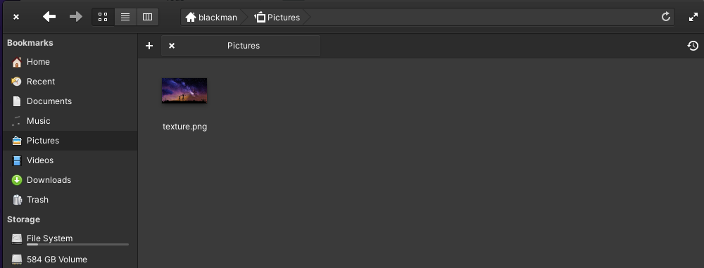

# elementaryOS-lockscreen-bgreplacer

This script is meant to be used in Elementary OS 6 Odin. You must be root user in order for it to work. You need an image called texture.png inside your Pictures folder. Everytime greeter is updated, you need to run this again.

## What do you need

* gnome-settings-daemon >= 3.27
* libaccountsservice-dev
* libgdk-pixbuf2.0-dev
* libgranite-dev >= 5.5.0
* libgtk-3-dev
* libhandy-1-dev >= 0.90.0
* liblightdm-gobject-1-dev
* libmutter
* libwingpanel-2.0-dev
* libx11-dev
* meson
* valac
* git
* imagemagick-6.q16 (For blur version)

To install dependencies:

```
sudo apt install git
sudo apt install -y gnome-settings-daemon libaccountsservice-dev libgdk-pixbuf2.0-dev libgranite-dev libgtk-3-dev libhandy-1-dev liblightdm-gobject-1-dev libmutter-6-dev libwingpanel-dev libx11-dev meson valac imagemagick-6.q16
``` 

#### You need to put any png image called "texture.png" (with your desired resolution) in /home/your_username (or "$SUDO_USER")/Pictures, otherwise this won't work!

## Installation

### Become root user

```
sudo -i
cd /tmp/
```

### Clone the repository

Open a terminal and run the following git command:

```
git clone https://github.com/Blackmanx/elementaryOS-lockscreen-bgreplacer bgreplacer
cd bgreplacer
```

### Put an image in Pictures folder called texture.png (with its png format).



### Run script

```
bash background.sh
```

or, if you want blur

```
bash background-blur.sh
```

Restart and done.

## Source

https://www.debugpoint.com/2021/07/change-lock-login-screen-background-elementary-os/
